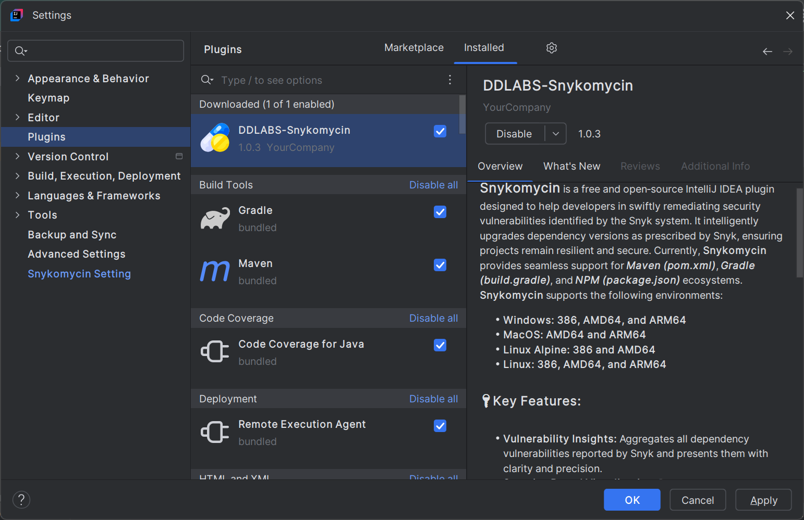

Synkomycin IntelliJ IDEA Plugin to fix dependency issues reported by Snyk System
==========================================================================================
# 🌿 Introduction:
**💊 Synkomycin** is a free and open-source IntelliJ IDEA plugin designed to help developers swiftly remediate 
security vulnerabilities identified by the Snyk system. It intelligently upgrades dependency versions as prescribed by Snyk, 
ensuring projects remain resilient and secure.
Currently, **Synkomycin** provides seamless support for **_Maven (pom.xml)_**,
**_Gradle (build.gradle)_**, and **_NPM (package.json)_** ecosystems.

**Synkomycin** supports the following environments:

- **Windows: 386, AMD64, and ARM64**
- **MacOS: AMD64 and ARM64**
- **Linux Alpine: 386 and AMD64**
- **Linux: 386, AMD64, and ARM64**

# 🔑Key Features:

- **Vulnerability Insights:** Aggregates all dependency vulnerabilities reported by Snyk and presents them with clarity and precision.
- **Severity‑Based Visualization:** Demonstrates vulnerabilities categorized by severity— **Critical**, **High**, **Medium**, and **Low**
        in a sortable tabular format.
- **One‑Click Remediation:** Effortlessly upgrades fixable dependencies with a single click.
Contextual Integration: Offers a dedicated context menu, Snykomycin, 
with intuitive sub‑menus: “**_Show Snyk Issues_**” and “**_Update Dependencies_**".

# 💻 Technology Stack
The following framework/s and tool/s have been used in this current sample application.

<table>
  <tr>
    <th>Name</th>
    <th>Version</th> 
  </tr>
  <tr>
    <td>Java</td>
    <td>21</td> 
  </tr>
  <tr>
    <td>IntelliJ Platform (Open API & Swing)</td>
    <td>2025</td>
  </tr>
  <tr>
    <td>Gradle</td>
    <td>9.0</td>
  </tr>
</table>

# 💧 How to use it ?
Go to File -> Settings -> Plugins and type `DDLABS Synkomycin` in intellij idea marketplace and click the button `install`. 
The screenshot is given below.

# 🌟 Why Snykomycin: 
Security vulnerabilities are reported periodically by the Snyk system, requiring developers to manually retrieve information
and update dependencies. It is a dilatory process and impedes the momentum of development.
Snykomycin eliminates this friction by enabling rapid dependency upgrades within a minute and accelerates development velocity.

# ❤️ Why You’ll Love It
**Synkomycin** is a small light-weight plugin which acts as a small antidote to security vulnerabilities without any side effect.
It is an attempt to turn chaos into clarity during development.

# ⚠️ Limitations:
At present, Snykomycin does not provide automated upgrade, originating from transitive dependencies.
Active development efforts are underway to extend support and 
deliver comprehensive resolution for all transitive dependency issues in future releases.

# 🐛Bugs and Feedback
There may be some bugs or error, please feel free to report/contact me 📫 **deba.java@gmail.com**

# 📄 License
©Copyright 2025 Debadatta Mishra(DD)
Free and Open Source licensed under the Apache License, Version 2.0.

✍️ Contributor: **Debadatta Mishra(DD/PIKU)**

# 👉 Snykomycin: A creation from Tornado</h3>
From the visionary mind at Tornado comes **Snykomycin** — an attempt by an Engineer to solve real problems and to simplify developers’ lives.
🧐 Wanna to 🤝 join with me to a new challenging technical task ? I will be thankful to you for few words of appreciation 🙏.

### 👦 About Me
-  A developer who crafts with Java’s enterprise power 
    and Python’s versatility.
- 😌 A simple, sober, unsphisticated and unpretentious person.
- 😧 Passing through a difficult phase of life.
- 🕉️ A strong believer in God & 🙏 to 

